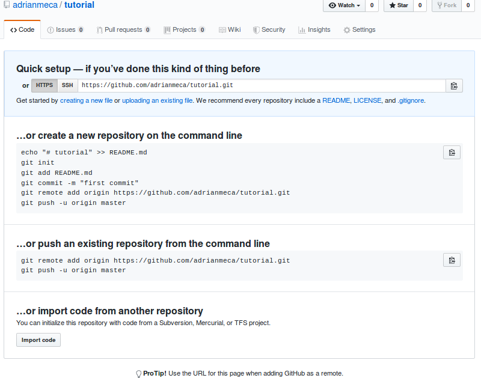
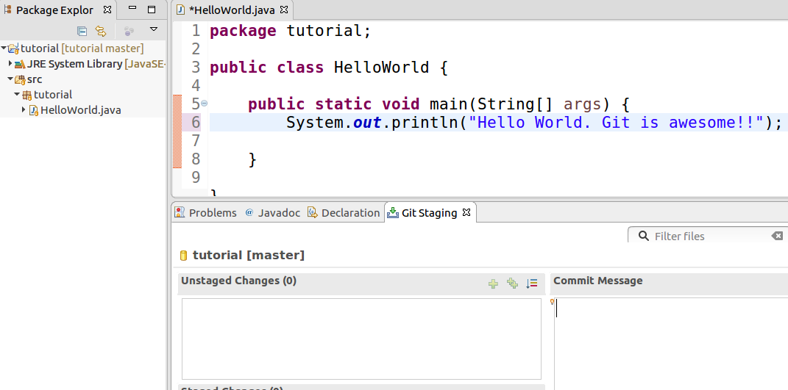
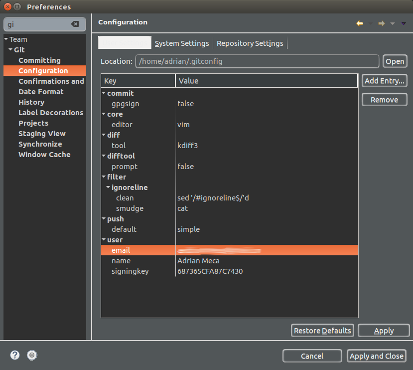

# Tutorial Git

## Crear repo
Utilizaremos github en este tutorial pero puede utilizarse gitlab en su lugar o cualquier otro servicio de git similar.

1. Ir a github.com
2. Loguearse al sitio con su cuenta. Si aún no tiene una cuenta cree una gratuita.
3. Crear un nuevo repostorio haciendo click en el botón de la imagen

  
4. Ingresar datos e información inicial del repositorio.

  * Elegir un nombre para el repositorio.
  * Opcionalmente ingrese una escripción.
  * Indicar si desea que sea publico o privado (en este tutorial usaremos uno público).
  * No crearemos readme, gitignore ni licencia ya que queremos un repositorio vació e inicializarlo localmente.
  * Finalmente cree el repositorio presionando el botón de la imagen

  
5. Nos mostrará el siguiente contenido para confirmar que el repositorio se ha creado

  
6. A continuación invitaremos a nuestros compañeros de equipo como colaboradores en el repositorio.

  * Seleccionamos la pestaña Settings.
  * Allí a la izquierda elegimos la opción Collaborators
  * Por cada compañero ingresamos el nombre de usuario de nuestros compañeros y hacemos clic en el botón Add collaborator.

  
7. Una vez que completamos esta acción nuestros compañeros recibiran un email para aceptar nuestra invitación a colaborar.

## Uso de Git en IDE
Utilizaremos eclipse for java ee developers que ya cuenta con EGit incluido. En caso de no contar con esta versión de eclipse puede agregarse el plugin de EGit.

Para representar dos usuarios diferentes y simplificar comprender que acciones relizaría cada uno utilizaremos dos eclipse con diferentes *Themes* (Dark y Light) y llamaremos a los usuarios de dicho eclipse con el mismo nombre respectivamente. Es decir usuario "dark" y usuario "light".

### Crear, inicializar y pushear una versión inicial de nuestro proyecto.
Para este caso hemos creado usando Eclipse un proyecto llamado tutorial el cual sólo cuenta con una clase HelloWorld que muestra por consola "Hello World"

Con el usuario **dark**
1. Vemos la siguiente estructura en el proyecto:

  
2. Crear e inicializar el repositorio:

  * Hacemos clic derecho sobre el proyecto.
  * Vamos a la opción Team > Share Project...

  
3. Seleccionamos la ubicación de nuestro proyecto para el proyecto de git y creamos un repositorio allí

  * En la ventana que se abre seleccionamos la opción Use or create repository in parent folder of project
  * Seleccionamos en la lista el proyecto y su ubicación, no nos permite tildar la casilla de verificación y vemos que dicha ubicación se completa en el cuadro de texto del fondo.

  
  * Hacemos click en Create Repository y veremos que se tilda la casilla de verificación del proyecto.
  * Hacemos click en finish

  

4. Revisamos el status en git

  Vemos en el Project/Package explorer que junto a los íconos del proyecto se muestra un pequeño cilindro amarillo y junto a la carpeta src, el package tutorial y el archivo HelloWorld.java se muestra un ícono de **?**

  Esto indica que el proyecto tiene un repositori git asociado pero existen cambios sin agregar al index de git.

  

5. Agregar los cambios en index

  * Hacemos click con el botón derecho en el proyecto.
  * Vamos a la opción Team > Add to Index

  

  * Vemos en el Project/Package explorer que los íconos de antes ahora cambiaron por un **\*** blanco (significa cambios en la estructura) en el proyecto, carpeta source y package y un **+** verde (significa agregado) en el archivo HelloWorld.java

  
6. A continuación commiteamos los cambios a git
  * Hacemos click derecho sobre el proyecto.
  * Vamos a la opción Team > Commit...

  

  * Aparecerá la pestaña Git Staging

  En este punto podemos ver a la izquierda en la parte inferior los archivos modificados que se encuentran en el index (Staged Changes) y en la parte superior los archivos modificados que NO se han agregdos al index (Unstaged Changes). Al hacer commit sólo se incluirán los cambios que si se hayan agregado al index.

  A su vez en Commit Message DEBEMOS agregar un comentario que no de una idea de que cambio se realizó.

  Debajo en Author y Commiter esta información va en la configuración de Git pero puede modificarse para el commit actual o dentro de eclipse. (Véase anexos)

  
  * Luego de esto podemos hacer click en Commit and Push o Commit. Nosotros sólo haremos commit para mostrar como proceder si falla el push o no se cuenta con conexión en ese momento.

  * Una vez que el presionamos Commit vemos en el Project/Package explorer.

  

7. Pusheamos los cambios del proyecto a github.

  * Nos dirigimos a la página del repositorio, allí seleccionamos la opción para la url del repo. Usaremos https por simplicidad, si tienen configurado una key ssh puede usar la opción ssh.
  * Seleccionamos la opción HTTPS y hacemos clic en el botón a la derecha para copiar la url o la copiamos a mano.
  

  * Hacemos click derecho sobre el proyecto.
  * Seleccionamos la opción Team > Push Branch 'master'...

    Nota: Sólo la primera vez, a continuación debemos usar Push to Upstream

  

  * Aparecerá una ventana para configurar el repositorio remoto.

  

  * En el Remote name dejaremos origin por convención.
  * Pegamos allí la url del repo que copiamos antes, se autocompletará casi toda la información.
  * Ingresamos usuario y contraseña de github.

    Nota: si utiliza una PC compartida no almacene la contraseña en el Secure Store

  * Hacer click en Next >
  * Configuramos como branch remota para sincronizar el mismo nombre (en este caso master)
  * Seleccionamos la opción Configure upstream for push and pull.
  * Elegimos la acción default a realizar el pull como Merge
  * **NO** seleccionamos el Force overwrite branch in remote if it exists and has diverged para evitar perder los cambios realizados por otros.

  

  * Veremos entonces la confirmación del push

  

  * Veremos una ventana para confirmar el push que deseamos realizar, allí hacemos click en Finish

  

### Clonar el repositorio, realizar cambios y pushearlos.
Para este caso abrimos eclipse en un workspace diferente para simular otro usuario.

Con el usuario **light**
1. Vamos a github.com, accedemos al repositorio y copiamos la url del repositorio para clonar.

  * Accedemos a la página de github del repo.
  * Hacemos click en el botón Clone or download.
  * Elegimos la opción HTTPS.
  * Copiamos el enlace.

  
2. Clonamos el repositorio

  * En eclipse vamos al menu Window >

  
  * Seleccionamos la perspectiva Git

  
  * Vemos entonces la siguiente perspectiva, allí podemos hacer click en la opción Clone a Git repository o hacerlo en la misma opcion del menú de herramientas

  
  * Se abrirá la siguiente ventana
  * Pegamos la url que copiamos del repositorio donde indica URI
  * Completamos lo datos de usuario y contraseña
  * Hacemos click en Next

  
  * Nos mostratrá la lista de branch que deseamos clonar.
  * Dejamos seleccionada master.
  * Hacemos click en Next

  
  * Nos mostrará la siguiente ventana
  * IMPORTANTE: En Destination > Directory reemplazamos la ubicación propuesta por el directorio donde se creará el proyecto, es decir la ubicación del workspace que utilizamos en eclipse (en este ejemplo /home/adrian/gittuto/workspace2/) acompañado del nombre del repositorio (en este caso tutorial)
  * Seleccionamos master como la rama inicial
  * Para la definición del nombre del repositorio remoto (el que se encuentra en github) usaremos origin (por convenición)
  * IMPORTANTE: seleccionamos la opción import all existing Eclipse projects after clone finishes para asegurarnos que el proyecto se agregue al Project/Package explorer
  * Hacemos click en Finish

  
  * Nos aparecerá ahora el repositorio agregado a la lista de repositorios de la pestaña Git Repositories

  
  * En la parte superior derecha podemos ver las distintas perspectivas, elegimos la de Java o Java EE para ver el proyecto y el código fuente

  
  * Navengando en el Project/Package explorer y veremos lo siguiente
  

3. Realizar cambios

  * Realizamos una edición en el código y vemos que mientras no guardemos los cambios git no muestra cambios en los archivos del project/package explorer ni la pestaña de git staging.

  
  * Una vez que guardamos los cambios vemos en el project/package explorer que delante del archivo modificado y en la estructura del proyecto un signo **>** para mostrar ar./img/33-addToIndex.pngchivos con cambios que no se han agregado al index. También vemos en la pestaña de git staging el archivo modificado.

  

4. Agregar cambios al index.

  * Hacemos click derecho sobre el proyecto y elegimos la opción Team > Add to Index

  

  * En el project/package explorer vemos que ahora se muestra un **\*** en los archivos modificados cuyos cambios se han agregado al index de git. A su vez en git staging vemos al archivo en la pestaña de git staging en la sección Staged Changes

  

5. Commit

  * Hacemos click derecho sobre el proyecto y seleccionamos la opción Team > Commit

  
  * Si aún no tenemos abierta la ventana de git staging se abrirá. Allí ingresamos un mensaje de commit y presionamos commit

  
  * Veremos entonces en el project/package explorer el archivo y la estructura pasan a tener nuevamente un cilindro amarillo junto al ícono y junto al proyecto vemos una flecha en dirección ascendente con un 1 a la derecha. Esto indica que localmente hemos hecho un commit que no hemos pusheado aún.

  

6. Pull

  **Nota**: no es necesario realizar un pull antes de push, pero en caso que haya cambios en el repositorio remoto hecho por otro compañero si no hacemos pull antes del push veremos un mensaje de error y deberemos hacer pull antes del push.

  * Para hacer pull hacemos click derecho sobre el proyecto y seleccionamos la opcion Team > Pull

  
  * Veremos la siguiente ventana de confirmación, en este caso sin cambios.

  

7. Push

  * Para realizar push hacemos click derecho sobre el proyecto y seleccionamos la opción Team > Push to upstream

  
  * Vemos la siguiente ventana de confirmación

  

### Obtener cambios realizados por otro miembro del equipo.
Para este caso abrimos eclipse en el workspace original para simular nuestro primer usuario.

Con el usuario **dark**
1. Pull
  * Abrimos el proyecto original y vemos el código sin modificar.

  
  * Hacemos click derecho sobre el proyecto y seleccionamos la opción Team > Pull

  

  * Vemos la siguiente ventana de confirmación con los cambios recibidos sin conflicto
  

  * Vemos el nuevo código fuente
  

## Anexo

### Configurar usuario y mail para push
1. Hacemos click en el menú Window > Preferences si se abrirá la ventana de preferencias
2. Completamos en la búsqueda "git"
3. En la opción **Configuration** ingresamos el valor que deseemos en user email y name
  
4. Presionamos Apply and Close
